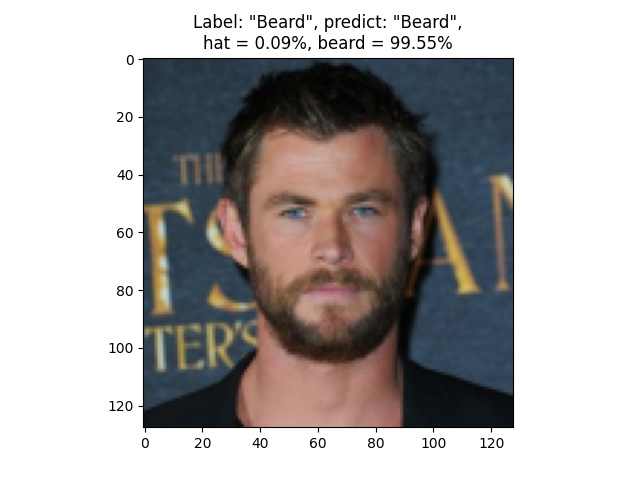
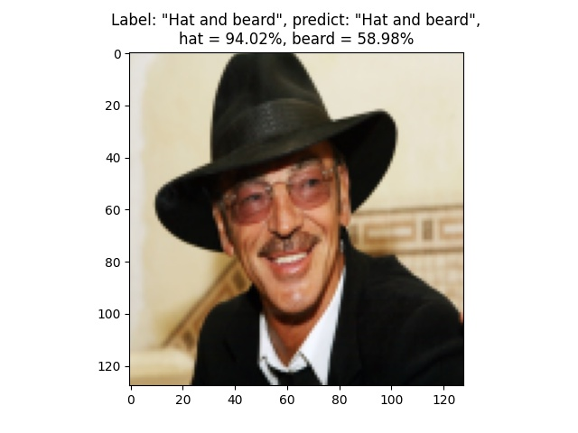
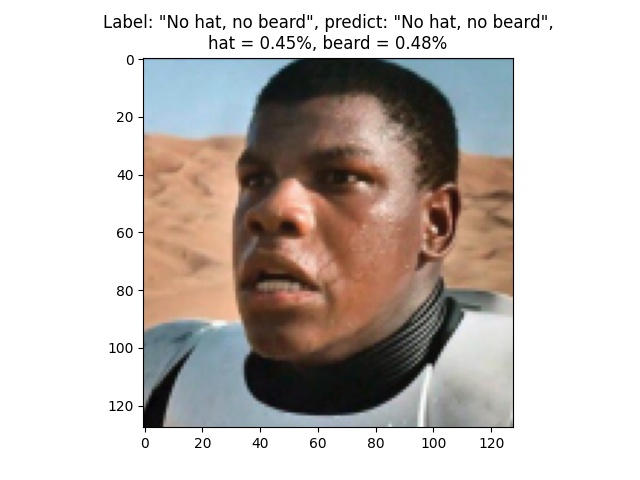

# Train and test hat/beard classifier

Scripts for training, converting and testing convolutional neural network for hat/beard classifying.

Feature of the current approach is the CNN architecture with **two independent outputs** for
classifying the presence of a `hat` and/or `beard` in the image. The cropped head images are used.

See dataset and training parameters in `config.py`.

Images are classified into two categories.
1) **The presence of a headgear** (class `hat`): any headgear (hat, cap, etc.) is present or any headgear
   is completely absent.

2) **The presence of facial hair** (class `beard`): mustache, beard, noticeable stubble or any facial
   hair is completely absent.

Scripts are based on my small keras-tf-cv-library https://gitlab.com/_chiffa_/cv_utils (sorry if you don't have access).

## 1. Dataset preparation

My dataset has this configuration:
```
hat_beard_dataset/
    00_no_hat_no_beard/
        image_1.jpg
        image_2.jpg
        ...
    01_hat/
        ...
    02_beard/
        ...
    03_hat_beard/
        ...
```

Run this script to prepare dataset for training and testing:
```shell script
python prepare_data.py path/to/hat_beard_dataset/
```
If you pass the parameter `--test` to it, you can see original and augmented images with labels
from the prepared dataset.

## 2. Training
Run training script with default parameters:
```shell script
python train.py path/to/hat_beard_dataset/
```
Or run this to see all training parameters:
```shell script
python train.py --help
```

## 3. Converting
Use this to convert trained model to frozen tf 1.x graph and onnx model:
```shell script
python convert.py --weights path/to/trained/weights.h5
```

## 4. Testing
Evaluate loss and metrics (only keras .h5 weights) on testing data:
```shell script
python validate.py evaluate --weights path/to/weights.h5
```
Test model (any type of weights) performance and get metrics via
sklearn.classification_report:
```shell script
python validate.py validate --weights path/to/weights.pb
```
Visualize model predictions on testing data:
sklearn.classification_report (any type of weights):
```shell script
python validate.py predict --weights path/to/weights.onnx
```
Or run this to see all validating parameters:
```shell script
python validate.py --help
```

## Current results

### custom_resnet18

```
Testing model "custom_model_best_031_epoch.h5".

Train data:
loss = 0.1642; hat_loss = 0.0864; beard_loss = 0.1106; hat_recall = 0.9467; hat_precision = 0.9511; hat_F1_score = 0.9443; beard_recall = 0.9428; beard_precision = 0.9493; beard_F1_score = 0.9426

Test data:
loss = 0.1325; hat_loss = 0.0592; beard_loss = 0.0759; hat_recall = 0.9603; hat_precision = 0.9529; hat_F1_score = 0.9516; beard_recall = 0.9531; beard_precision = 0.9656; beard_F1_score = 0.9543

```

```
Using model "custom_model_best_031_epoch.onnx". Using gpu: None.
Mean inference time: 0.0028. Mean FPS: 358.6258.
                  precision    recall  f1-score   support

No hat, no beard       0.97      0.98      0.97      2044
             Hat       0.91      0.92      0.92       336
           Beard       0.94      0.89      0.91       502
   Hat and beard       0.93      0.94      0.94       236

        accuracy                           0.95      3118
       macro avg       0.94      0.93      0.94      3118
    weighted avg       0.95      0.95      0.95      3118

```

Prediction examples:




